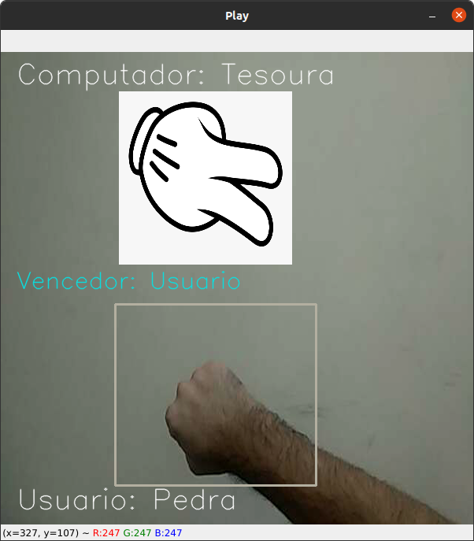

### Hi there 👋

- My names is Carlos.
- I'm 22 years old.
- 🌱 I'm currently studying Computer Engineering.
- ₿ Bitcoin

Skils:
- 🐧 Linux
- 🐍 Python
- 🤖 Deep Learning
- 🧠 Neural Networks / Tensorflow / Pytorch
- 🌲 SkLearn
- 👁 Computer Vision

<!--
**carlsec/carlsec** is a ✨ _special_ ✨ repository because its `README.md` (this file) appears on your GitHub profile.

Here are some ideas to get you started:

- 🔭 I’m currently working on ...
- 🌱 I’m currently learning ...
- 👯 I’m looking to collaborate on ...
- 🤔 I’m looking for help with ...
- 💬 Ask me about ...
- 📫 How to reach me: ...
- 😄 Pronouns: ...
- ⚡ Fun fact: ...
-->

 - <h3>Publications</h3>
 - Utilizando Visão Computacional para jogar pedra, papel e tesoura contra o computador.
 - https://github.com/carlsec/rps_classifier
 - https://carlsec.medium.com/utilizando-vis%C3%A3o-computacional-para-jogar-pedra-papel-e-tesoura-contra-o-computador-8d94e23ef9f1
 - 
